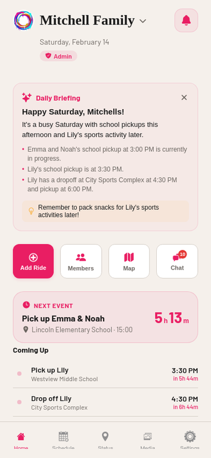

<p align="center">
  
</p>

<h1 align="center">RideFlow</h1>

<p align="center">
  <strong>AI-powered family ride coordination for iOS and Android.</strong><br/>
  Schedule rides, track riders in real time, and keep every parent in the loop — all from one app.
</p>

<p align="center">
  <a href="https://ridehelp.top"></a>
  
  
  
  
  
</p>

---

## About

RideFlow is a production-grade mobile application that replaces scattered text messages and phone calls between parents and their ride helpers (nannies, carpoolers, family members) with a purpose-built coordination platform. The app handles ride scheduling, live GPS tracking, real-time chat, photo and video status reports, rider payroll, and AI-powered automation — all within a single, cohesive experience.

The project is architected as a **full-stack monorepo** containing a React Native (Expo) client and a co-located Express/tRPC server backed by PostgreSQL, S3 file storage, WebSocket messaging, and built-in multimodal AI capabilities. It was designed from the ground up for production deployment, with comprehensive security hardening, offline-first data caching, and App Store submission readiness.

### By the Numbers

| Metric | Count |
|--------|-------|
| Lines of code | 59,230 |
| Screens | 47 |
| Reusable components | 44 |
| tRPC API endpoints | 177 (80 queries, 97 mutations) |
| Database functions | 142 |
| Database tables | 32 |
| Custom hooks | 10 |
| Test cases | 812 across 51 test files |
| TypeScript errors | 0 |

---

## App Preview

<p align="center">
  <a href="https://ridehelp.top/#preview">
    
  </a>
</p>

<p align="center">
  <strong><a href="https://ridehelp.top/#preview">Watch the full video walkthrough on ridehelp.top &rarr;</a></strong>
</p>

---

## Architecture

RideFlow follows a layered monorepo architecture where the mobile client and API server share types, validation schemas, and business logic through a co-located codebase. This eliminates the contract drift that plagues separate frontend/backend repositories and enables end-to-end type safety from database queries through to rendered UI components.

```
┌──────────────────────────────────────────────────────────────────┐
│                        Mobile Client                             │
│  React Native 0.81 · Expo SDK 54 · Expo Router 6 · NativeWind 4 │
│  ┌────────────┐  ┌──────────────┐  ┌──────────────────────────┐ │
│  │ 47 Screens │  │ 44 Components│  │ TanStack Query + Offline │ │
│  └─────┬──────┘  └──────┬───────┘  └────────────┬─────────────┘ │
│        └────────────────┼────────────────────────┘               │
│                         │ tRPC Client                            │
├─────────────────────────┼────────────────────────────────────────┤
│                    API Gateway                                   │
│  Express 4 · tRPC 11 · WebSocket (ws) · Rate Limiter            │
│  ┌──────────────────┐  ┌──────────────┐  ┌────────────────────┐ │
│  │ 177 tRPC Endpoints│  │ Access Control│  │ OAuth (Google,     │ │
│  │ (80Q / 97M)      │  │ Family-Scoped │  │  Apple, Facebook)  │ │
│  └────────┬─────────┘  └──────┬───────┘  └────────────────────┘ │
│           └───────────────────┼───────────────────────────       │
│                               │                                  │
├───────────────────────────────┼──────────────────────────────────┤
│                        Data Layer                                │
│  ┌──────────────┐  ┌─────────┐  ┌──────────┐  ┌──────────────┐ │
│  │ PostgreSQL   │  │ S3 File │  │ Built-in │  │ Push         │ │
│  │ Drizzle ORM  │  │ Storage │  │ LLM / AI │  │ Notifications│ │
│  │ 32 Tables    │  │         │  │          │  │              │ │
│  └──────────────┘  └─────────┘  └──────────┘  └──────────────┘ │
└──────────────────────────────────────────────────────────────────┘
```

### Tech Stack

| Layer | Technology | Purpose |
|-------|-----------|---------|
| **Mobile Client** | React Native 0.81, Expo SDK 54, Expo Router 6 | Cross-platform iOS/Android/Web with file-based routing |
| **Styling** | NativeWind 4 (Tailwind CSS) | Utility-first styling with automatic dark mode via CSS variables |
| **State & Data** | TanStack Query, AsyncStorage | Server state management with offline-first caching |
| **Real-Time** | WebSocket (ws) with polling fallback | Sub-second chat delivery with graceful degradation |
| **API** | tRPC 11, superjson, Zod | End-to-end type-safe RPC with runtime validation |
| **Server** | Express 4, Node.js 22 | HTTP server with middleware pipeline |
| **Database** | PostgreSQL, Drizzle ORM | Relational data with type-safe query builder |
| **File Storage** | S3-compatible object storage | Photos, videos, voice notes, and documents |
| **Auth** | Google OAuth, Apple Sign-In, Facebook Sign-In | Multi-provider authentication with session tokens |
| **Maps** | Google Maps (web/Android), Apple Maps (iOS) | Geocoding, directions, Places autocomplete |
| **AI/LLM** | Built-in multimodal AI | Text, image, and audio analysis — no external API keys |
| **Push** | Expo Notifications | Server-triggered push with per-category preferences |
| **Monitoring** | Sentry | Crash reporting and performance tracing |
| **Testing** | Vitest | 812 unit and integration tests |

---

## Features

### Scheduling & Calendar

The scheduling engine supports **day, week, and month** calendar views with drag-to-reschedule in the day timeline. Events carry descriptive titles (e.g., "to MVLA Soccer Practice"), activity type color coding (school, sports, music, medical), and multi-child assignment. Recurring events support daily, weekly, biweekly, and monthly patterns. Event templates enable one-tap creation of frequently repeated rides, and the "copy from previous day / last week" feature accelerates schedule duplication. A built-in conflict detection system identifies overlapping events and suggests resolution options.

### AI-Powered Automation

RideFlow integrates AI throughout the user experience rather than confining it to a single feature. **AI Quick Fill** lets users describe a ride in natural language to auto-populate the event form. **Voice-to-Schedule** enables hands-free event creation via microphone dictation. **AI Schedule Import** accepts an entire week's schedule pasted from iMessage or dictated aloud, parsing it into structured events. The **AI Daily Briefing** generates a personalized morning summary with highlights and tips. Status report photos are analyzed to auto-generate ride notes. An **@AI Chat Assistant** responds to schedule questions directly within any chat thread. The system also performs **anomaly detection** — flagging late arrivals, missed updates, and unusual patterns — and **route optimization** using Haversine-based calculations for multi-stop rides.

### Real-Time Tracking & Communication

Live GPS tracking displays rider locations on an interactive map with event-aware ride hour windows (clipped to a configurable buffer around scheduled events). The **WebSocket-powered chat** system delivers messages instantly with automatic polling fallback when WebSocket connections are unavailable. The messaging suite includes family group chat, private direct messages, and custom group chats with admin controls, member management, emoji reactions, typing indicators, read receipts, and image sharing. The **Events Map** provides an interactive Google Maps view with route directions between scheduled stops.

### Status Reporting & Media

Riders document ride completions through a unified flow that captures arrival/departure times, photos, videos, and voice notes with AI transcription. Parents receive push notifications and can respond with comments (supporting nested reply threads) and like/reaction acknowledgments. A dedicated **Media Gallery** tab aggregates all photos and videos across the family with filtering by date, child, and rider.

### Rider Management & Payroll

Each rider maintains a profile with driver license details, vehicle information (make, year, model, mileage, last service date), and insurance documentation. The payroll system combines **GPS-based ride hour tracking** (clipped to event windows) with **rider self-reported hours** that require parent approval. Configurable discrepancy alerts fire when reported hours exceed GPS tracking by a threshold the admin sets. Hourly rates, commute buffer settings, and weekly payroll summaries with CSV export round out the compensation workflow.

### Family Management & Approval Flow

Families are created with invite codes that can be shared via QR code or deep link. New members who join via invite code enter a **pending approval state** — they cannot access schedules, status reports, media, or chats until the family admin approves their request. Admins see a red badge on the Home screen indicating the number of pending requests. Pending members can withdraw their request at any time. Requests that remain unapproved for 7 days auto-expire with in-app notifications to both parties. Role-based access control ensures parents see everything while riders see only their assigned events.

### Notifications & Offline Support

Push notifications cover ride completions, chat messages, status changes, and smart alerts for overdue rides. Per-category notification settings (Events, Messages, Location, Reports) and quiet hours scheduling give users fine-grained control. The notification inbox supports swipe-to-dismiss and mark-as-read gestures. **Offline-first caching** persists critical data to AsyncStorage for instant app loading. A global query cache with 30-second stale time and 10-minute retention reduces network traffic. Deferred loading on the Home screen staggers API calls to avoid request storms. Eight database indexes on frequently queried columns keep server response times low.

---

## Database Schema

The data model spans **32 PostgreSQL tables** organized into seven domains, all defined in a single Drizzle ORM schema file with full TypeScript type inference.

| Domain | Tables | Description |
|--------|--------|-------------|
| **Identity** | `users`, `families`, `family_members`, `family_invite_codes`, `family_activity_log` | User accounts, family groups, membership with approval workflow, and invite codes |
| **Scheduling** | `ride_events`, `recurring_events`, `event_templates`, `app_settings` | Ride events with recurrence, reusable templates, and per-family configuration |
| **Reporting** | `status_reports`, `status_report_likes`, `report_comments` | Ride completion reports with media, reactions, and threaded comments |
| **Messaging** | `chat_messages`, `direct_messages`, `group_chats`, `group_chat_members`, `group_chat_messages` | Family chat, private DMs, and custom group conversations |
| **Location** | `location_shares`, `location_updates` | GPS tracking sessions and coordinate history |
| **Profiles** | `child_profiles`, `rider_profiles`, `emergency_contacts` | Children, rider credentials/vehicle info, and emergency contacts |
| **Operations** | `notifications`, `notification_preferences`, `push_tokens`, `rider_reported_hours`, `helper_availability` | Push delivery, notification settings, payroll hours, and availability |

---

## Security

RideFlow implements defense-in-depth security across every layer of the stack.

| Control | Implementation |
|---------|---------------|
| **Authentication** | Google, Apple, and Facebook OAuth with server-side session token management |
| **Authorization** | Family-scoped middleware on all 177 tRPC endpoints; role-based access (admin, parent, rider) |
| **Rate Limiting** | Token bucket — 100 req/min per user, 1,000 req/min per family |
| **Input Validation** | Zod schemas with `.max()` constraints on all 136 string inputs |
| **File Upload** | MIME type allowlist, size enforcement, S3 pre-signed URLs |
| **Transport** | HTTPS-only with HSTS, X-Content-Type-Options, X-Frame-Options, CSP headers |
| **CORS** | Explicit origin allowlist (no wildcards) |
| **CSRF** | Origin header validation for web platform requests |
| **Privacy** | GDPR-compliant in-app data export and account deletion |

---

## Project Structure

```
rideflow/
├── app/                          # 47 screens (Expo Router file-based routing)
│   ├── _layout.tsx               # Root layout — providers, auth guard, error boundary
│   ├── (tabs)/                   # Tab navigator (Home, Schedule, Status, Media, Settings)
│   ├── login.tsx                 # Multi-provider authentication
│   ├── onboarding.tsx            # 20-page interactive tutorial
│   ├── add-event.tsx             # Event creation with AI Quick Fill
│   ├── complete-ride.tsx         # Unified ride completion + status report
│   ├── family-chat.tsx           # Family group chat with @AI assistant
│   ├── dm-chat.tsx               # Private direct messaging
│   ├── group-chat.tsx            # Custom group chats with admin controls
│   ├── events-map.tsx            # Interactive map with route directions
│   ├── location-map.tsx          # Live rider tracking map
│   ├── ai-schedule.tsx           # AI schedule import from natural language
│   └── ...                       # 35 additional screens
├── components/                   # 44 reusable UI components
├── hooks/                        # 10 custom React hooks
├── contexts/                     # React context providers
├── lib/                          # 24 utility and business logic modules
├── server/                       # 30 server-side modules
│   ├── routers.ts                # 177 tRPC API endpoints
│   ├── db.ts                     # 142 database query functions
│   ├── websocket.ts              # WebSocket server for real-time chat
│   ├── ai-features.ts            # AI briefing, anomaly detection, suggestions
│   ├── ai-schedule.ts            # Natural language schedule parsing
│   ├── access-control.ts         # Family-scoped authorization middleware
│   └── rate-limit.ts             # Token bucket rate limiter
├── drizzle/
│   └── schema.ts                 # 32 database table definitions
├── __tests__/                    # 51 test files, 812 tests
├── docs/                         # Technical documentation
├── screenshots/                  # App Store screenshots (1290x2796)
└── assets/images/                # App icons, splash screens, illustrations
```

---

## App Store Readiness

RideFlow is prepared for submission to both the Apple App Store and Google Play Store. The project includes all required assets and metadata:

- **Privacy Policy** and **Terms of Service** hosted at [ridehelp.top/privacy-policy.html](https://ridehelp.top/privacy-policy.html) and [ridehelp.top/terms-of-service.html](https://ridehelp.top/terms-of-service.html)
- **App Store screenshots** at 1290x2796 (iPhone 6.7") with device frames and marketing copy
- **Marketing landing page** at [ridehelp.top](https://ridehelp.top)
- **EAS Build** configured for iOS and Android production builds
- **GDPR-compliant** data export and full account deletion

---

## Website

This repository hosts the public marketing website at **[ridehelp.top](https://ridehelp.top)**, deployed via GitHub Pages with a custom domain. The site is a static, single-page application built with vanilla HTML and CSS — no frameworks, no build step, no JavaScript dependencies. It loads in under one second and weighs approximately 34 KB.

| Page | Path | Description |
|------|------|-------------|
| Landing Page | `/` | Product marketing with hero section, interactive phone mockups, AI feature showcase, and download badges |
| Privacy Policy | `/privacy-policy.html` | GDPR-compliant privacy policy |
| Terms of Service | `/terms-of-service.html` | Legal terms governing app usage |

---

## License

Proprietary. All rights reserved.
